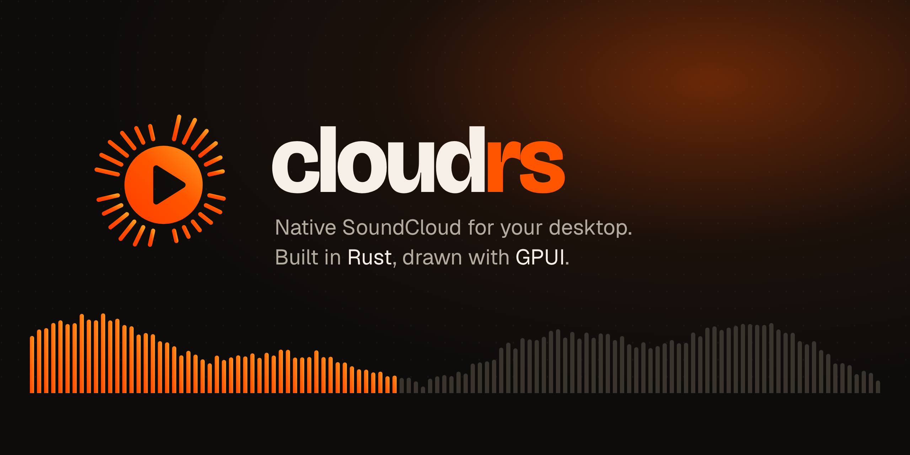
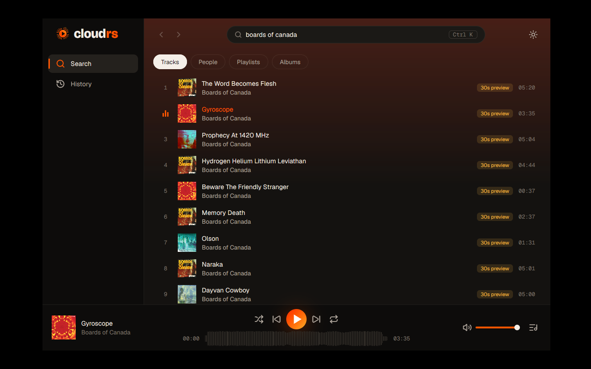
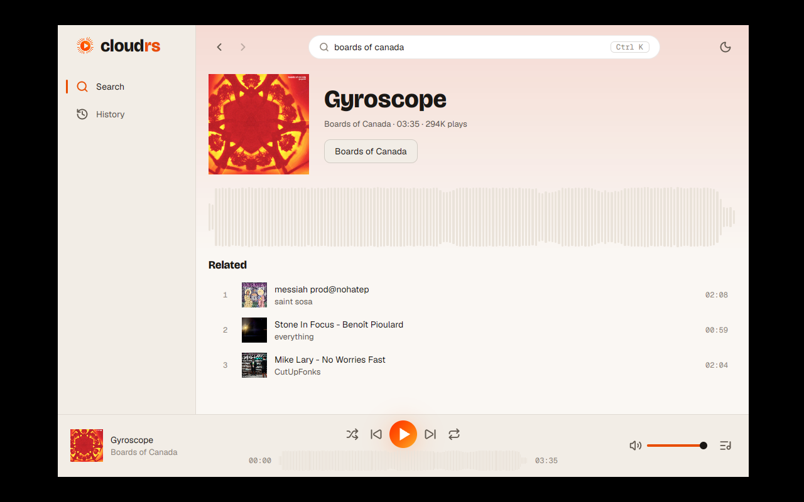
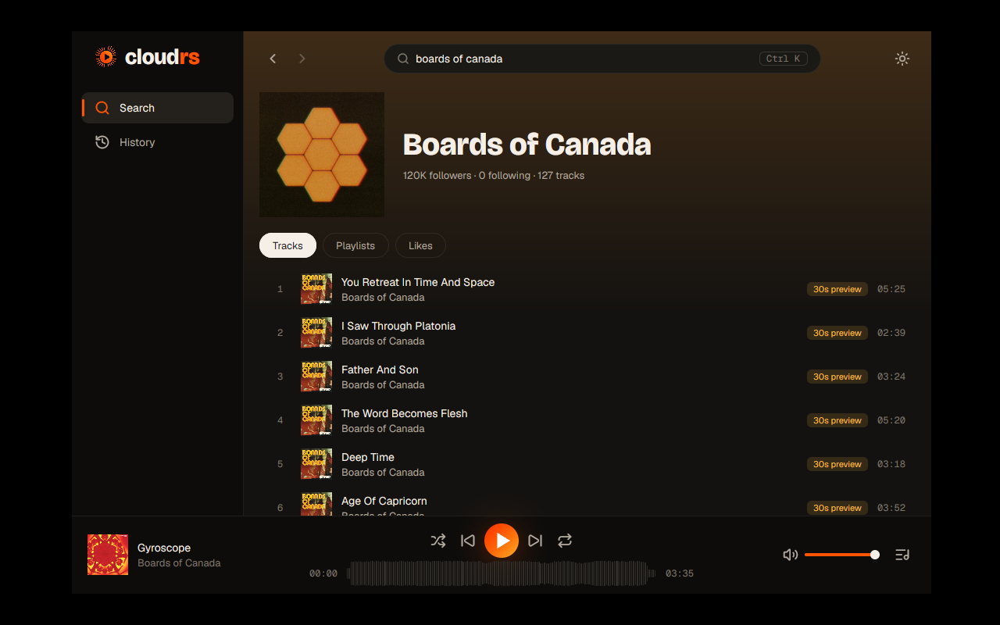
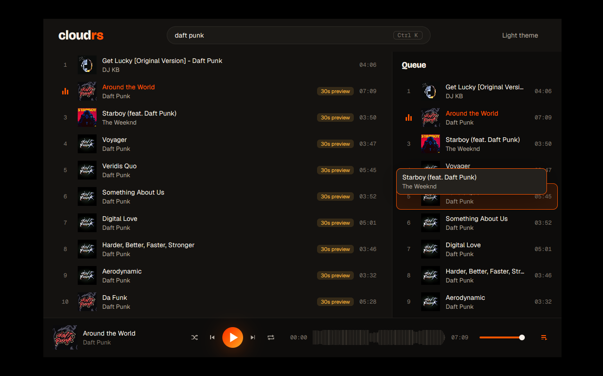

<p align="center">
  
</p>

<p align="center">
  <a href="LICENSE"></a>
  
  
  
</p>

<p align="center">
  <a href="#download">Download</a> ·
  <a href="#what-it-does">What it does</a> ·
  <a href="#jam-listen-together">Jam</a> ·
  <a href="#screenshots">Screenshots</a> ·
  <a href="#build-from-source">Build from source</a> ·
  <a href="#architecture">Architecture</a> ·
  <a href="#roadmap">Roadmap</a>
</p>

---

**cloudrs** is a native, open source desktop client for SoundCloud. There is no Electron and no
webview in the main window. The interface is drawn on the GPU with
[GPUI](https://github.com/zed-industries/zed/tree/main/crates/gpui), the UI framework behind the
Zed editor, and the audio is decoded in Rust. It opens fast and stays light on memory, and it is
made for people who keep SoundCloud playing all day: long mixes, DJ sets and underground tracks.

It also does something the website doesn't: **Jam**. Start one, share a link, and your friends
hear the same track at the same moment, wherever they are.

> **0.1.0 beta 1.** This is the first public build. Expect rough edges, and please
> [open an issue](https://github.com/pablozr/cloudrs/issues) when something breaks.

## Download

| System | File | Notes |
| --- | --- | --- |
| **Windows 10/11** | `cloudrs_0.1.0-beta.1_x64-setup.exe` | Installs for your user only (no admin). |
| **Linux** | `.deb` or `.AppImage` | Needs WebKitGTK 4.1 for the sign-in window. |
| **macOS** | `.dmg` | Untested by us in this beta. |

The beta is **not code-signed** yet, so your system will warn you the first time:

- **Windows:** SmartScreen says "Windows protected your PC". Click **More info**, then **Run anyway**.
- **macOS:** right-click the app, choose **Open**, then confirm.

Signed Windows builds are on the way; see the [code signing policy](#code-signing-policy).

## What it does

**Home**
- Opens on a Home that greets you by the time of day, with a highlight of what you are
  playing, quick tiles, your playlists, trending tracks by genre, SoundCloud's own curated rows
  and charts, and, signed in, new tracks from people you follow, your likes and the artists
  you follow.

**Listen**
- Search tracks, people, playlists and albums, with infinite scroll.
- Paste any `soundcloud.com` link in the search field to play a track or open a profile or
  playlist.
- SoundCloud's waveform is the seek bar. Hover over it to preview a position, click to jump.
- Track, profile, playlist and album pages, with back and forward navigation (`Alt ←` / `Alt →`
  and the mouse's side buttons).

**Queue**
- A real queue: play next, add to queue, drag to reorder, remove.
- Shuffle that can be undone, and repeat one or all.
- When the queue runs out, autoplay continues with related tracks, as on the website.
- History, and the session comes back when you reopen the app: queue, position and volume.

**Your account**
- Sign in with your SoundCloud account in a small window, using the normal SoundCloud sign-in.
  You can also paste a token if a provider refuses the window.
- Feed, Likes, Library and Following.
- Like tracks and follow people.
- Make your own playlists: add any track from its row or page, reorder them by dragging,
  remove a track (with Undo), rename them, make them public or private, delete them. They
  are one click away in the sidebar, and the Library shows them as a grid of covers.
- Your session is kept in your system's keychain (Credential Manager, Keychain or Secret
  Service). It is never written anywhere else.

**Look and feel**
- Dark and light themes that follow the system and are remembered, and a title bar of its own with the cloudrs logo.
- Each page takes on the color of its artwork.
- Settings (the gear in the title bar): theme, Discord, cache and the list of shortcuts.
- Keyboard: `Ctrl K` (or `/`) jumps to search, `Ctrl P` opens the command palette. Space plays or pauses, ← → seek 5 s, Shift ← → previous/next,
  Ctrl L likes, Ctrl V opens a copied SoundCloud or Jam link. Every control has visible focus and a label
  for screen readers.

## Jam: listen together

1. Open **Jam** in the sidebar and choose **Start a Jam**.
2. Copy the link (`cloudrs:jam/…`) and send it to your friends.
3. They paste it in the search field and join.

Everyone hears the same track at the same moment. Guests can always add tracks. You choose
whether they can also play, pause, skip and seek. If someone can't play a track (a GO+ preview
or a region block), you see it next to their name. When you end the Jam, everyone gets their
own queue back.

How it works:
- **Peer to peer.** Your apps connect directly when your networks allow it. Otherwise they go
  through public relays ([iroh](https://iroh.computer)), so a Jam works from anywhere with an
  internet connection.
- **No cloudrs server.** Nothing about the session is stored anywhere.
- **Only state travels:** track ids, positions and the queue. Every person plays the audio from
  SoundCloud with their own account.
- **The link stays useful only during that Jam.** It is made for that Jam alone and stops
  working when the Jam ends. It does not carry your IP address.

## Screenshots

<table>
  <tr>
    <td width="50%"></td>
    <td width="50%"></td>
  </tr>
  <tr>
    <td align="center"><sub>Search, with the player bar and the waveform</sub></td>
    <td align="center"><sub>A track page (light theme)</sub></td>
  </tr>
  <tr>
    <td width="50%"></td>
    <td width="50%"></td>
  </tr>
  <tr>
    <td align="center"><sub>A profile</sub></td>
    <td align="center"><sub>Reordering the queue</sub></td>
  </tr>
</table>

Colors, type, motion and components are documented in
[docs/design/VISUAL-IDENTITY.md](docs/design/VISUAL-IDENTITY.md).

## Build from source

**Requirements:** stable Rust 1.91 or newer.
- **Windows:** the Visual Studio Build Tools with the C++ workload.
- **Linux:** these development packages:

```sh
sudo apt install libasound2-dev libxkbcommon-dev libxkbcommon-x11-dev libwayland-dev \
  libx11-xcb-dev libxcb1-dev libvulkan-dev libfontconfig-dev libzstd-dev \
  libwebkit2gtk-4.1-dev libgtk-3-dev
```

```sh
git clone https://github.com/pablozr/cloudrs
cd cloudrs
cargo run -p cloudrs --release
```

| Command | What it does |
| --- | --- |
| `cargo run -p cloudrs --release --no-default-features` | Builds without Jam (about 8 MB smaller) |
| `cargo install cargo-packager --locked` then `cargo packager --release` | Builds this system's installers into `target/packages` |
| `cargo run -p sc-session --example jam -- host` | Tests a Jam connection without the app |
| `cargo run -p sc-session --example jam -- join "<link>"` | Joins that test connection from another machine |

## Architecture

A Rust workspace in layers. Dependencies point one way, and `tests/architecture` checks it in CI.

| Path | Role |
| --- | --- |
| `apps/cloudrs` | The desktop app (GPUI): screens, i18n, composition root |
| `crates/cloudrs-ui` | Design system: tokens, theme, motion, primitives |
| `crates/sc-core` | App state, queue, Jam rules, persistence (SQLite), artwork cache |
| `crates/sc-api` | SoundCloud `api-v2` client: `client_id`, search, pages, account |
| `crates/sc-audio` | Audio engine: HLS/MP3 → symphonia → cpal, on its own thread |
| `crates/sc-session` | Jam transport: peer-to-peer sessions over iroh |
| `crates/sc-platform` | OS integration: keychain and the sign-in window |
| `tests/architecture` | Layering rules |

The UI sends commands to `sc-core` and draws its events. It never talks to SoundCloud, the audio
engine or the network itself. The plan is in [docs/PLAN.md](docs/PLAN.md), and every decision
is in [docs/adr/](docs/adr/).

## Roadmap

- [x] **M0 · Spike.** SoundCloud client, HLS playback, the first GPUI window.
- [x] **M1 · Playable MVP.** Search, play, player bar with waveform, paste a link to play.
- [x] **M2 · Navigation.** Track, profile, playlist and album pages, the full queue, autoplay,
  history, session restore.
- [x] **M3 · Your account.** Sign in, feed, likes, library, following, like and follow.
- [x] **Jam.** Listening together over peer-to-peer, from anywhere, with no server.
- [ ] **M4 · Desktop integration.** Media keys and system controls (SMTC, MPRIS, Now Playing),
  full shortcuts, audio device choice, timed comments, settings.
- [ ] **M5 · 0.1.0.** Gapless playback, loudness, equalizer, mini player, tray, signed
  installers, first translations.

## Contributing

Ideas, issues and pull requests are welcome. Good places to start:
- **Platform integration:** media keys, and packages for each system.
- **Translations:** the interface is built for more languages ([how it works](docs/design/i18n.md)).
- **Design:** new components that follow the [visual identity](docs/design/VISUAL-IDENTITY.md).

Before sending a pull request:

```sh
cargo fmt --all -- --check
cargo clippy --workspace --all-targets --locked -- -D warnings
cargo test --workspace --locked
```

Keep commits small, one topic each, in English. See [CONTRIBUTING.md](CONTRIBUTING.md) and
[AGENTS.md](AGENTS.md).

## Disclaimer

cloudrs is an **unofficial** client. It is not affiliated with, endorsed or sponsored by
SoundCloud.
- It streams what SoundCloud already makes available to you.
- It does not download tracks, remove ads or unlock paid content.
- A Jam shares only what is playing, never the audio.

All trademarks belong to their owners.

## Code signing policy

cloudrs is applying to the [SignPath Foundation](https://signpath.org) for free code signing of
its Windows releases. Once accepted: free code signing provided by
[SignPath.io](https://signpath.io), certificate by [SignPath Foundation](https://signpath.org).

- Only the installers built by this repository's
  [release workflow](.github/workflows/release.yml), on GitHub-hosted runners from a `v*` tag,
  are signed. Nothing built on a personal machine is.
- Every signing request is approved by hand before it is signed.

**Team roles**

| Role | Members |
| --- | --- |
| Committers and reviewers | [pablozr](https://github.com/pablozr) |
| Approvers | [pablozr](https://github.com/pablozr) |

**Privacy.** cloudrs collects no telemetry and has no server of its own. It connects only to
what you use:

- **SoundCloud**, to browse, stream and manage your account
  ([SoundCloud privacy policy](https://soundcloud.com/pages/privacy)). Your sign-in token stays
  in your system's keychain.
- **Discord**, through the Discord app on your computer, to show what you are listening to.
  It can be turned off in Settings ([Discord privacy policy](https://discord.com/privacy)).
- **Jam**, only when you start or join one: a peer-to-peer connection to the other listeners,
  through public [iroh](https://iroh.computer) relay servers when a direct path is not possible.
  It carries what is playing and your name and avatar, never the audio.

## License

[MIT](LICENSE) © cloudrs contributors. Third-party notices are in [NOTICE](NOTICE).
