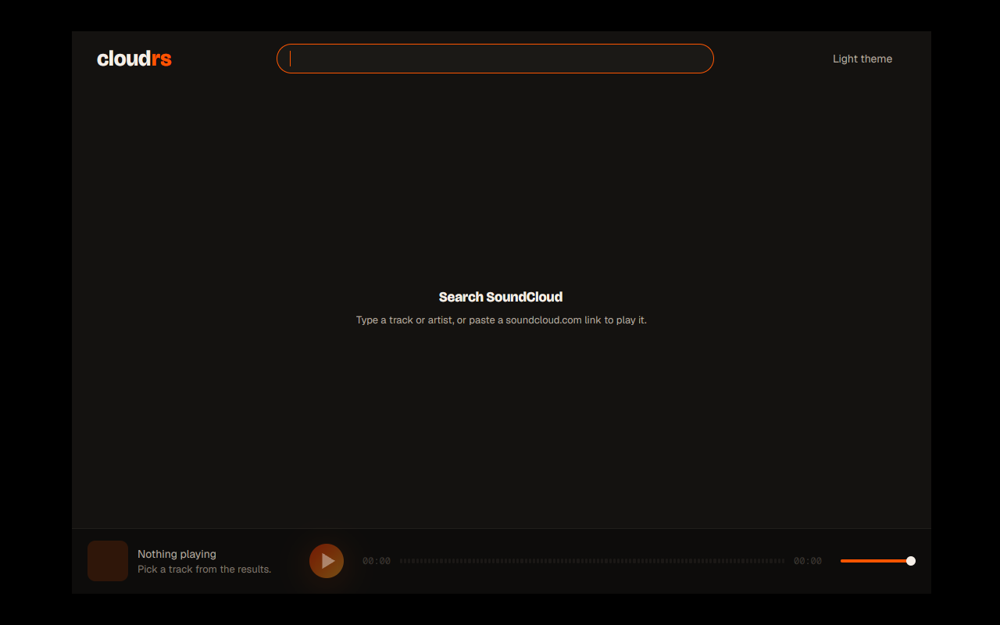
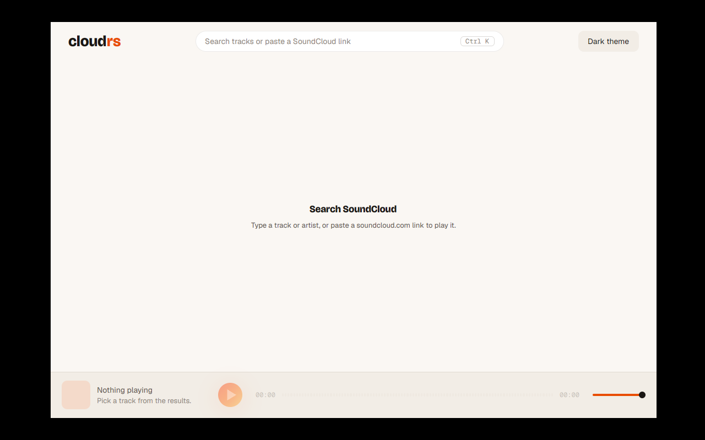
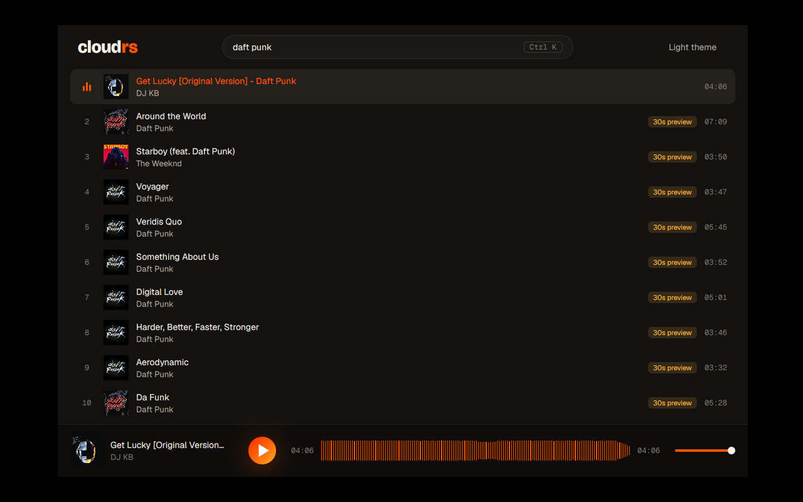
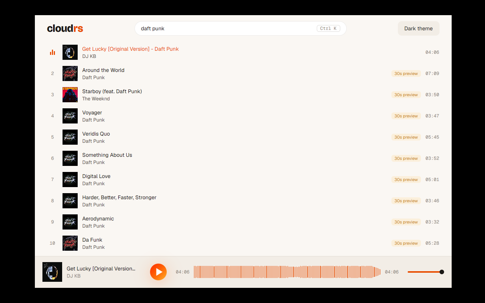
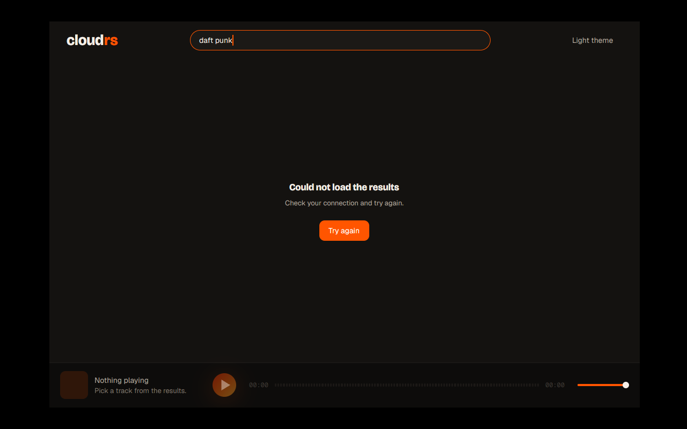
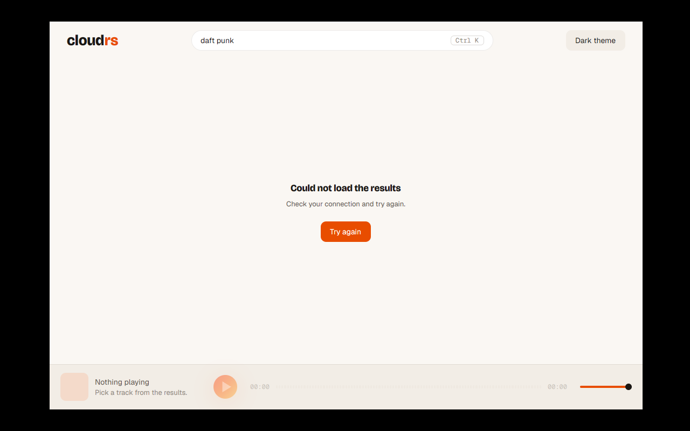

# ADR 0005: M1 app shell

Status: accepted · 2026-10-06 (all options chosen by the maintainer)

## Context

ADR 0004 defined `sc-core` and the command/event contract. M1 still needs the app on top of it:
search, results, a player bar with seek and volume, problems shown to the person, and artwork.
Position updates arrive about ten times per second, so how view state is split matters for idle
cost.

## Decisions

1. **One owner of the core.** A `Shell` view owns the `CoreHandle`, runs the only event pump
   (`events().recv_async()`), keeps the search results and forwards player events to the
   player bar.
2. **The player bar is its own entity.** Position ticks re-render only the bar, never the
   results list. The bar sends nothing to the core itself: it emits actions that the shell
   forwards as `Command`s.
3. **View state is plain data.** Results and player state are structs with an `apply(Event)`
   step and no GPUI types, so they are tested with recorded events.
4. **New `cloudrs-ui` primitives:**
   - `waveform` takes `Arc<[f32]>` (no clone per render) and reports a seek fraction on click;
   - `slider` for the volume;
   - `toast` for problems, entering with `motion::pop_in` and leaving after 4 s;
   - `track_row` and `skeleton_row`, as listed in the visual identity;
   - a `tooltip` builder, because every icon-only control needs one.
5. **Problems.** Runtime problems appear as a toast. If the core cannot start (no audio
   device), the window shows a full problem state with a "Try again" action.
6. **No sidebar in M1.** A header (wordmark, search field, theme switch), the results and the
   player bar. The sidebar arrives with the screens it navigates to (M2).
7. **The M0 preview is removed.** The shell replaces it; its screenshot stays in ADR 0003.
8. **Keyboard in M1.** `Ctrl K` (`Cmd K` on macOS) and `/` focus the search field; `/` does not
   fire while the field has focus. Every control has visible focus, an `aria_label` and, if
   it shows only an icon, a tooltip. Space, arrows and the full command palette arrive in M4.
9. **Pasted links.** Search text that is a `soundcloud.com` URL (`soundcloud.com`,
   `www.soundcloud.com`, `m.soundcloud.com`) is sent as `Command::PlayUrl` instead of a search.
   Plain string checks, no URL crate.
10. **Validation in a Linux container.** Windows Smart App Control blocks cargo's build scripts
    and proc-macro DLLs on the maintainer's machine, and rebuilding the blocked packages (the
    xemnas procedure) did not converge. Checks and screenshots run in a Docker container with
    the README packages, `Xvfb` and Mesa's lavapipe, as `AGENTS.md` describes.

## Consequences

- The idle cost while playing is one small view re-rendering at 10 Hz.
- The app has one place that talks to the core, so later screens (M2) add state structs and
  views without new channels.
- `cloudrs-ui` grows its public API (`waveform`, `slider`, `toast`, `tooltip`, `track_row`, `skeleton_row`).

## Screenshots

Taken in the Linux container (`Xvfb`, lavapipe, ALSA `null` device) against the live SoundCloud.
Audio was not heard.

| | Dark | Light |
|---|---|---|
| Empty |  |  |
| Playing |  |  |
| Offline error |  |  |

Also: [results](../assets/readme/m1-dark-results.png),
[a problem toast](../assets/readme/m1-dark-toast.png) and
[a scrolled list with the next page loaded](../assets/readme/m1-light-scrolled.png).

## Known limits

- The waveform seeks on click only; the hover preview of the target is not built.
- A failed `Command::LoadMore` drops the next page inside `sc-core`; the list stops asking
  for more and shows the problem toast.
