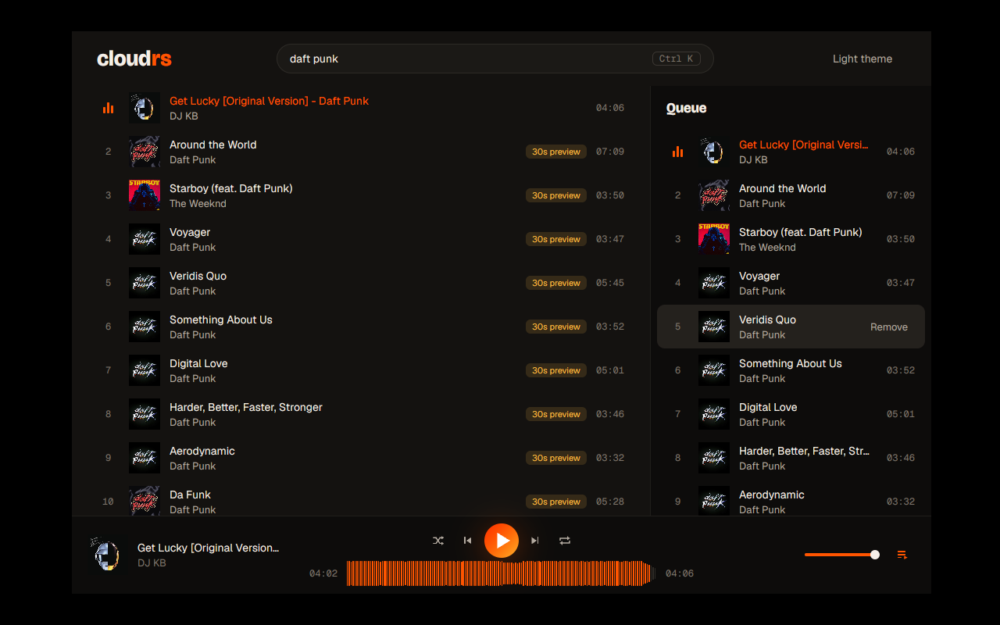
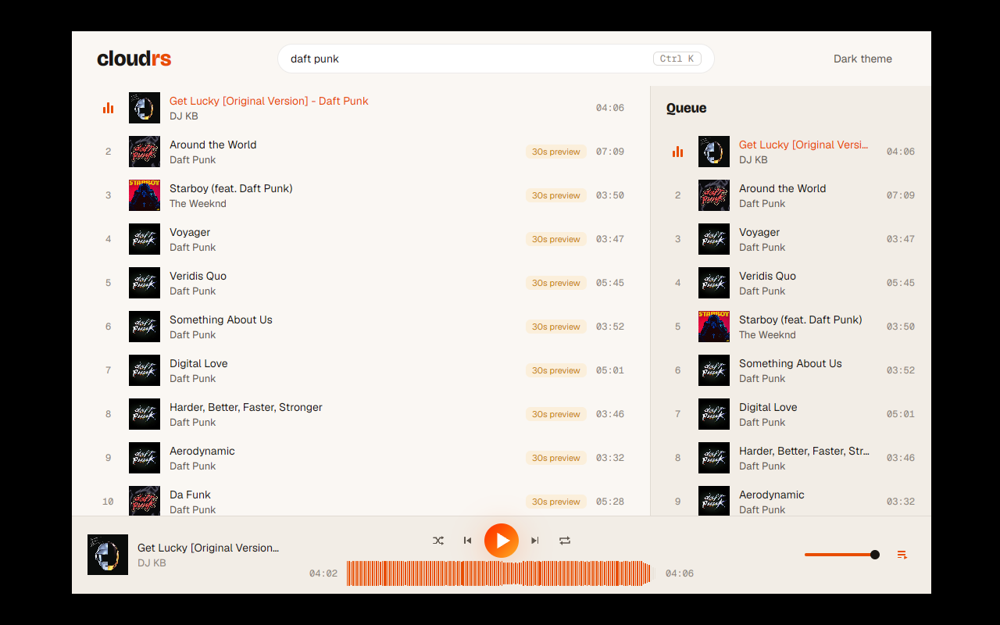
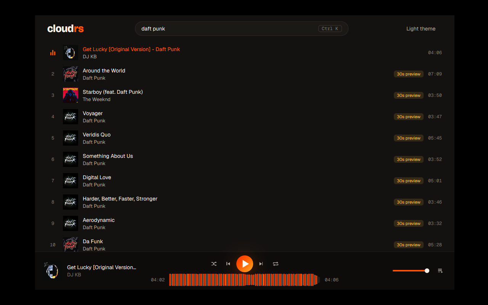
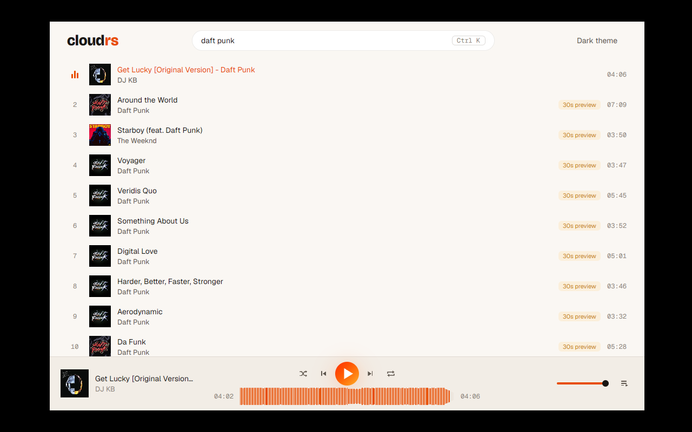

# ADR 0007: M2 — queue, autoplay and persistence

Status: accepted · 2026-10-06 (all options chosen by the maintainer)

## Context

M2 adds navigation screens and a real queue. The queue comes first: the screens need "play
next" and "add to queue", and listening together (ADR 0006) is built on the host's queue.

## Decisions

1. **Order.** M2 starts with the core: queue, autoplay, history and session restore. The
   Track, Profile, Playlist and Album screens and the sidebar follow.
2. **Playing from a list sets the context.** Clicking a result makes the queue the result list
   starting at that track (context "search X"), as on the website. Tracks added with "play next"
   or "add to queue" play before the rest of the context.
3. **Queue contract** (`sc-core`):
   - commands: `Next`, `Previous` (restarts the track when past 3 s), `PlayNext(TrackId)`,
     `AddToQueue(TrackId)`, `RemoveFromQueue(usize)`, `MoveInQueue { from, to }`,
     `PlayQueueIndex(usize)`, `SetShuffle(bool)`, `SetRepeat(Repeat)` with
     `Repeat::{Off, One, All}`;
   - event: `Queue(QueueSnapshot { tracks, current, shuffle, repeat })`, sent on every change.
   - Shuffle keeps the original order so turning it off restores it.
4. **Autoplay.** When the queue ends with repeat off, the core fetches `/tracks/{id}/related`
   for the last track and keeps playing.
5. **Screen data contract** (for the screens that follow): typed commands and events per
   screen (`OpenTrack(id)` → `TrackPage { .. }`, `OpenUser`, `OpenPlaylist`…), with core-owned
   types. Routes and the back/forward stack live only in the UI.
6. **Persistence: `rusqlite` with the `bundled` feature, in a `store` module of `sc-core`**
   (PLAN D7, §6). The database lives in `dirs::data_dir()/cloudrs/`. Writes run off the actor
   loop (`spawn_blocking`), so the core never waits on disk.
7. **Session restore.** Queue, current track, position and volume are saved and come back at
   start, paused at the saved position.
8. **History.** A track is recorded once it has played for 30 s. The History screen arrives with
   the other screens.
9. **Queue UI.** A side panel on the right, opened from a queue button in the player bar.
   Reorder by drag and drop, with the motion catalog's lift, accent outline and neighbors
   springing aside.
10. **A damaged database is reset, not fatal.** The file is renamed to
    `cloudrs.db.corrupt-<unix time>`, a new empty one is created and the person is told with a
    toast (`Problem::StorageReset`). A database written by a newer build is left untouched
    and not used (the app runs without saving) instead of being downgraded. The migration
    runs in one transaction with `user_version`, and a connection waits up to 2 s for a
    second instance.
11. **Orderly shutdown.** Closing the window sends `Command::Shutdown`. The core saves the
    session on its own thread (no `spawn_blocking`; the store lock waits for a write in
    progress), answers `Event::Stopped` and stops. The app waits up to 500 ms for the reply
    before quitting. A core that never changed anything does not write on exit, so a second
    instance cannot overwrite the saved session.
12. **Player bar layout.** A centre column, as in Spotify: transport on top, a wide waveform
    underneath with both times, artwork and title on the left, volume and the queue button on
    the right. The bar grows from 84 px to 100 px.

## Consequences

- `sc-core` gains its first disk state and a C build dependency (SQLite, bundled).
- The UI keeps one source of truth for what plays next: the `QueueSnapshot`.

## Screenshots

The queue panel, taken in the Linux container (`Xvfb`, lavapipe, ALSA `null` device) against the
live SoundCloud. Audio was not heard.

| Dark | Light | Dragging a row |
|---|---|---|
|  |  |  |

The player bar with the centre column:

| Dark | Light |
|---|---|
|  |  |

## Known limits

- While dragging, the neighbors do not spring aside (motion catalog 7): the dragged row is
  lifted with a shadow and an accent outline, and the drop target is highlighted.
- Row actions ("Play next", "Add to queue", "Remove") appear on hover only, so a keyboard user
  cannot reach them yet. The panel rows, the player bar buttons and the queue button are focusable.
- The current track cannot be removed from the queue.
- The session is saved on queue changes, on pause, every 5 s while playing, a second after the
  volume stops changing and when the window closes (not when the OS kills the app, or on
  Cmd-Q, which skips the window hook).
- Turning shuffle off after a restart keeps the restored order, since the pre-shuffle order is
  not saved.
