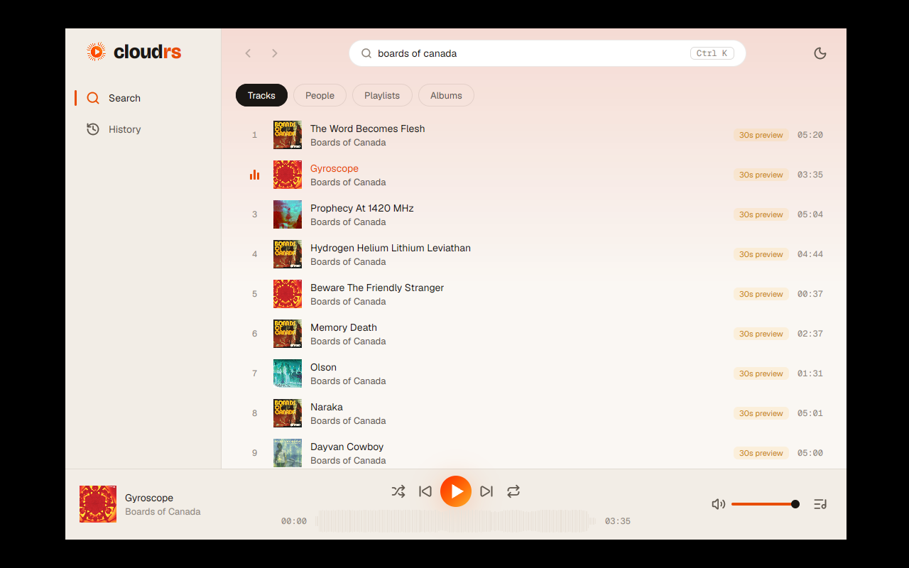
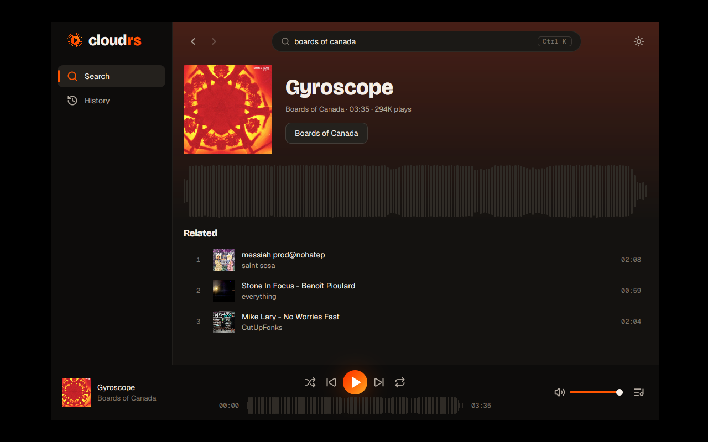
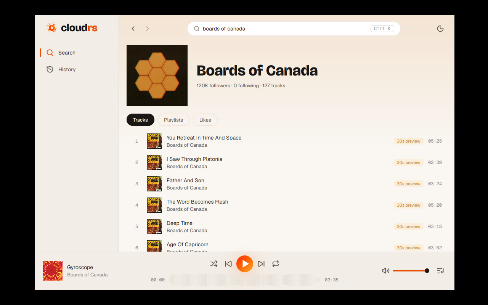
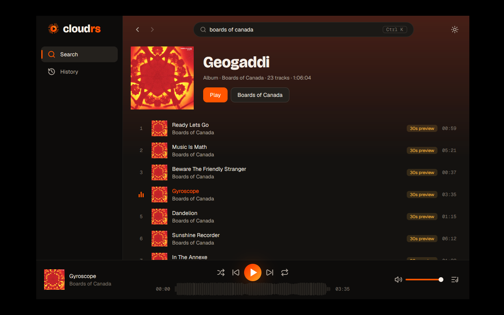
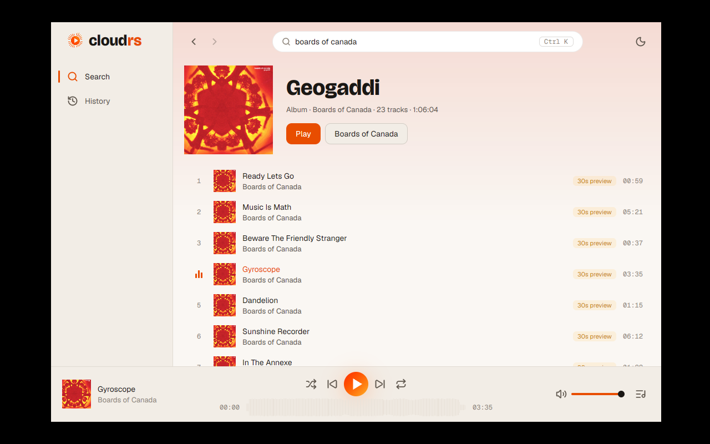
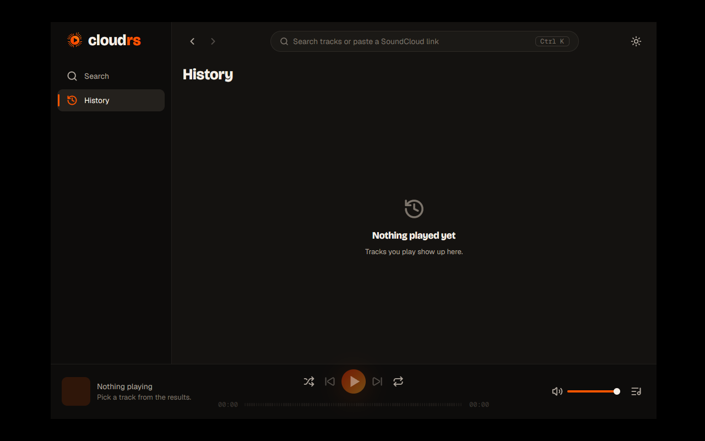
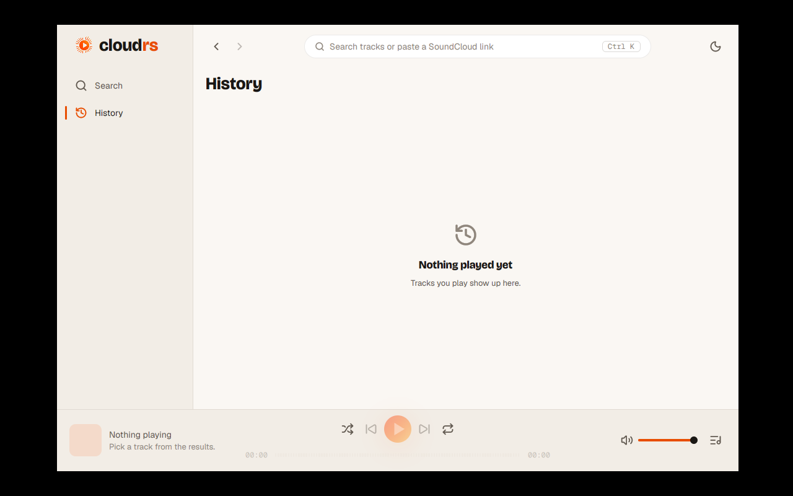

# ADR 0009: M2 polish — icons, logo, exe icon and artwork tint

Status: accepted · 2026-10-07 (all options chosen by the maintainer)

## Context

The M2 screens worked but looked unfinished: hand-painted glyphs on a few buttons, text where
an icon is the norm, no logo in the sidebar, no icon on the Windows executable, and flat
backgrounds while the content carries all the colour.

## Decisions

1. **Icons: embedded Lucide SVGs (ISC).**
   - Only the SVGs in use are copied into `assets/icons/`, unmodified, with
     `LICENSE-lucide.txt` (pinned at `lucide-static` 1.52.0).
   - `cloudrs_ui::assets::Assets` is an `AssetSource` that serves them with `include_bytes!`,
     like the fonts. `main.rs` registers it with `application().with_assets(..)`.
   - `components::icon(Icon, size, color)` draws one with GPUI's `svg()`, a monochrome mask
     tinted with a colour token. `Icon` keeps its role as the enum of glyphs and maps each
     variant to a path. Sizes are tokens: `ICON_S` 16, `ICON_M` 20, `ICON_STATUS` 40.
   - `paint_icon` is gone. The play/pause glyph of the gradient button stays hand-painted:
     Lucide's `play` and `pause` are outlines, and a filled glyph looks right on the gradient.
   - Where icons went: previous, next, shuffle, repeat, repeat-one, queue, back, forward
     (player and header); sidebar Search and History; a magnifier in the search field; the
     theme toggle (sun or moon, with a tooltip and aria label from i18n); the row actions
     "Play next", "Add to queue" and "Remove" (icon-only, tooltip and aria label); the volume
     control (volume or muted); and a muted large icon above every empty and error state.
2. **Logo next to the wordmark.** The symbol has a gradient, so `svg()` (a mask) cannot draw
   it. GPUI at the pinned revision rasterises SVG files in `img()` through resvg, in full
   colour, so the sidebar uses `img("brand/logo.svg")` with the same embedded asset source. The
   size is the `LOGO` token (32 px) and the gap is the clear space, a quarter of it
   (`LOGO_CLEAR_SPACE`).
3. **Icon in the `.exe`.**
   - `apps/cloudrs/build.rs` writes a one-line `.rc` (`1 ICON "<abs path>"`) into `OUT_DIR`
     and compiles it with `embed-resource` 3.0.12, only when `CARGO_CFG_TARGET_OS` is
     `windows`. It never panics: on failure it prints a `cargo:warning`.
   - `assets/brand/app-icon.ico` holds 16, 24, 32, 48, 64, 128 and 256 px, rendered from
     `app-icon.svg` with resvg.
   - Resource id 1 is what GPUI's Windows backend loads (`load_icon` in `gpui_windows`:
     `LoadImageW` with `PCWSTR(1)`, `IMAGE_ICON`), so the window, the taskbar and the file
     in Explorer share one icon.
4. **Background tinted by the artwork.**
   - A vertical gradient at the top of the content area (behind the header and the screen)
     goes from the artwork's dominant colour to nothing, using GPUI's `linear_gradient`.
   - The colour comes from a track, profile or playlist page's own image, and from the
     playing track on Search and History; with nothing playing there is no tint.
   - It is computed in the app (`apps/cloudrs/src/tint.rs`), never in `sc-core`: on
     `Event::Artwork` the shell decodes the cached file on the background executor, shrinks it
     to 32×32 and averages it weighted by chroma, which tapers to zero toward black and
     white, so greys count little. The result is kept per `ArtKey` (computed once) in
     `Models::art`, then the view is notified.
   - `Theme::tint` clamps lightness and saturation per theme and picks the opacity (lower on
     light). Height, opacities and limits are tokens (`tokens::tint`).
   - Changing the colour cross-fades over `motion::PAGE`: the old layer fades out while the
     new one fades in.
   - New dependency: `image` 0.25 in `apps/cloudrs`, with the jpeg, png and webp codecs that
     GPUI already compiles, so nothing new builds. The cache names files by key, not by codec,
     so the decoder sniffs the format from the bytes.

## Consequences

- Every icon is crisp at any scale and takes the theme colours.
- The cross build for Windows needs a resource compiler (`llvm-rc` or `RC`) for the icon. If
  it is missing the build still passes, with a warning, and the exe has no icon.
- Screenshots `m2-polish-*` were taken live against SoundCloud (Xvfb, lavapipe, ALSA null).
  The history-empty pair predates the final tint opacities, but that screen has no tint.

