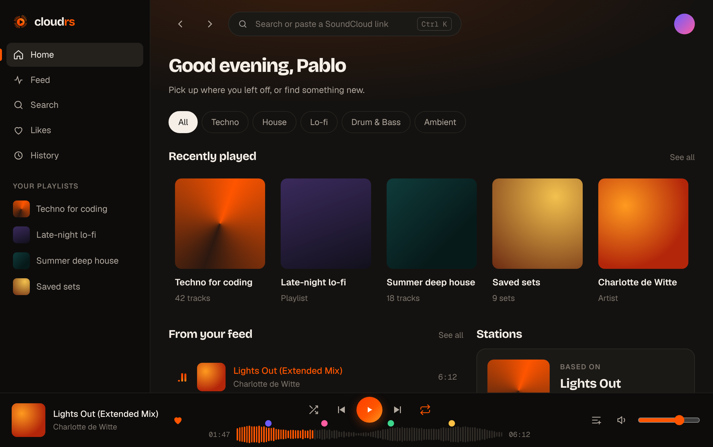

# Visual identity and design system

Status: approved v0.1 (2026-10-06). This is the rule for every screen in `apps/cloudrs`. All
values below become tokens in `crates/cloudrs-ui/src/tokens.rs`, the **only** place allowed to
hold raw colors, sizes or durations.

## Principles

1. **SoundCloud's orange, our own layout.** We share the palette, never SoundCloud's logo,
   layout or artwork.
2. **Native and light.** References: Zed (density, keyboard), Raycast and Arc (motion,
   materials). Nothing that would look like a webview.
3. **Motion explains.** Every animation answers an action and shows what changed. No decorative
   loops, except the "now playing" equalizer.
4. **Content first.** Artwork and waveforms carry the color. Chrome stays quiet in warm
   neutrals.

## Brand

| Asset | File |
|---|---|
| Symbol: "wave disc" (a circular waveform, echoing Rust's gear, around a play button) | [`assets/brand/logo.svg`](../../assets/brand/logo.svg) |
| App icon | [`app-icon.svg`](../../assets/brand/app-icon.svg), [`256 px`](../../assets/brand/app-icon-256.png), [`512 px`](../../assets/brand/app-icon-512.png) |
| README banner | [`banner.svg`](../../assets/brand/banner.svg), [`banner.png`](../../assets/brand/banner.png) |

- **Wordmark:** `cloudrs` in lowercase, Bricolage Grotesque ExtraBold, tracking −4.5%, with
  `rs` in the accent color.
- **Clear space:** at least 25% of the symbol's width on every side.
- **Do not:** put the symbol inside a cloud, recolor it outside the accent gradient, or pair it
  with SoundCloud's logo.

## Color

Neutrals lean slightly warm (brown), not blue-grey, so the orange feels at home. Dark is the
default theme, and light is complete.

### Accent

| Token | Value |
|---|---|
| `accent` | `#FF5500` (light theme: `#E84D00`, AA on white) |
| `accent.hover` | `#FF7A1A` |
| `accent.soft` | `#FF5500` at 14% |
| `accent.glow` | `#FF5500` at 35% (shadow of primary controls) |
| `accent.gradient` | `#FF3D00 → #FF5500 → #FF9A1F` at 135° |

Ramp: 50 `#FFF1E8` · 100 `#FFD9C2` · 200 `#FFB08A` · 300 `#FF8A52` · 400 `#FF6A1F` ·
**500 `#FF5500`** · 600 `#E84D00` · 700 `#B83C00` · 800 `#7A2A00` · 900 `#3A1400`.

The accent is reserved for: the primary action, the play button, progress, selection, focus and
"liked" state. Never for large surfaces.

### Neutrals

| Token | Dark | Light |
|---|---|---|
| `canvas.deep` (sidebar, player) | `#0D0C0B` | `#F2EDE6` |
| `canvas` | `#141210` | `#FAF7F3` |
| `surface` | `#1B1916` | `#FFFFFF` |
| `surface.raised` | `#24211D` | `#F2EDE6` |
| `surface.hover` | `#2F2B26` | `#EAE3DA` |
| `line` | `#FFECDC` at 8% | `#28190A` at 9% |
| `line.strong` | `#FFECDC` at 14% | `#28190A` at 16% |
| `text` | `#F5EFE8` | `#1A1714` |
| `text.muted` | `#B3AAA0` | `#5E564D` |
| `text.subtle` | `#7D756C` | `#8F867C` |

### Status

`success #3DD68C` · `warning #FFC145` · `danger #FF4D5E` · `info #5AA9FF`. Status colors never
replace the accent.

## Typography

All three faces are OFL-licensed and embedded in the binary, so the app looks the same on
every OS.

| Role | Face | Use |
|---|---|---|
| Display | Bricolage Grotesque (700/800) | Titles, artist and playlist names |
| UI | Geist (400/500/600) | Lists, buttons, body text |
| Numbers | Geist Mono, tabular | Time, counters, BPM |

| Token | Size / weight / tracking |
|---|---|
| `display.xl` | 40 / 800 / −3.5% |
| `display.l` | 28 / 700 / −2% |
| `title` | 18 / 700 / −1% |
| `body` | 14 / 500 |
| `body.muted` | 13 / 400 |
| `label` | 11 / 600 / +8%, uppercase |
| `mono` | 12 / 400, tabular figures |

## Space, shape and depth

- **Spacing:** 4 px scale: `4 8 12 16 20 24 32 48`.
- **Radii:**
  - `s` 6: badges, kbd;
  - `m` 10: buttons, rows, covers;
  - `l` 14: cards, toasts;
  - `xl` 20: panels, dialogs;
  - `full`: pills, play button, search.
- **Depth:** in dark mode, depth comes from lighter surfaces. Shadows only on floating things
  (menus, toasts, the dragged queue item). The primary play button uses `accent.glow`.

## Motion

Implemented with GPUI's native animation (`with_animation` and easing curves) through a
`motion` module in `cloudrs-ui`, following the shape of xemnas's `ui/motion`.

| Token | Value | Use |
|---|---|---|
| `motion.fast` | 120 ms · `ease.std` | hover, press, color changes |
| `motion.base` | 200 ms · `ease.out` | icons, buttons, show/hide |
| `motion.slow` | 320 ms · `ease.spring` | toasts, queue reorder, popovers |
| `motion.page` | 420 ms · `ease.out` | screen change (slide + fade + light blur) |
| `ease.std` | `cubic-bezier(.2, 0, 0, 1)` | |
| `ease.out` | `cubic-bezier(.16, 1, .3, 1)` | |
| `ease.spring` | `cubic-bezier(.34, 1.56, .64, 1)` | like, play, dropped queue item |

**Catalog:**
1. Play ⇄ pause morph; the button presses in and springs back.
2. "Now playing" equalizer on the active row, frozen while paused.
3. Waveform: hover previews the seek target, click seeks, progress advances while playing.
4. Like: squeeze, pop and an orange ring burst.
5. Screen change: old screen leaves left, new one enters from the right with a light blur.
6. Loading: skeleton with a soft shimmer in the shape of the final content, never a lone
   spinner.
7. Queue reorder: item lifts with shadow and an accent outline, and neighbors spring aside.
8. Toast: enters from below with a spring and leaves on its own after 4 s.

The OS "reduce motion" setting turns every duration down to an instant change.

## Components (`cloudrs-ui`)

- **Buttons:**
  - primary (accent fill);
  - secondary (raised surface);
  - outline (accent border);
  - ghost;
  - round icon button.
- **Search field:** pill shape, accent ring on focus, `Ctrl K` hint.
- **Filter pills:** the selected one is inverted (text color as fill).
- **Badges:** `AAC 160k`, `GO+`, `30s preview`, `Cached`, `Explicit`.
- **Slider:** volume.
- **TrackRow:**
  - index, artwork, title/artist, duration;
  - actions appear on hover;
  - the active row shows the equalizer and the accent title.
- **Card:** square cover; the play button rises on hover.
- **Toast:** artwork or status icon, text, optional action ("Undo").
- **PlayerBar:**
  - now playing + like;
  - transport controls with the gradient play button;
  - waveform with timed-comment pins;
  - queue and volume.
- **Sidebar:** brand, main navigation with an accent rail on the active item, "Your playlists".

Every surface has the full set of states: loading (skeleton), empty (what fills it), error (with
a real action) and confirmation (toast).
